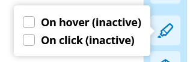
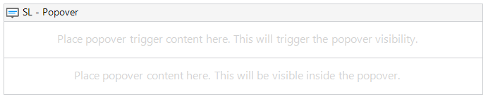

# SL Popover

Popover widget to show content in a styled popover element

## Description

You can use this widget to render any content when interacting with the trigger. You can set the trigger on hover, left-click and right-click. When choosing right-click then the popover behaves like a context-menu.

### Example

## Usage

* Place any content in the triggercontainer to trigger content-container
* Place any content in the content-container

### Modeler example

## Use Cases

* This can be used to create a context menu on a page.
* This can be used with or without context.

## Customization

To customize the content-container you can edit the styling with css using the classname:

* .sl-popover-content

## Image example

